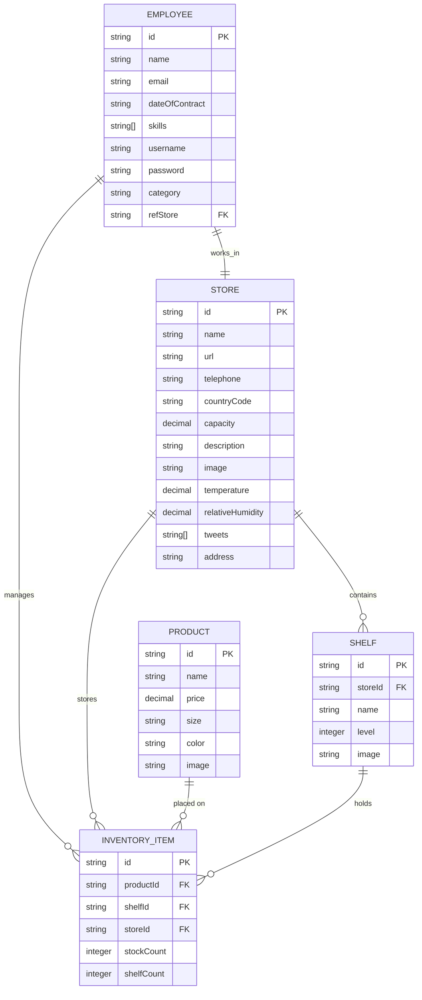

# Data Model Document

## 0. Implementation Status

- [x] Entity definitions and relationships documented
- [x] Employee.refStore relationship added
- [x] NGSIv2 URN-based IDs applied
- [x] Model classes created with to_ngsi() methods
- [x] Product list and detail views implemented
- [x] Employee list view with icons implemented
- [x] Product detail view with inventory grouped by store/shelf and add-to-shelf functionality
- [x] Active nav link highlighting in navbar
- [x] Stores Map view at /stores-map
- [x] Product Add/Edit modal form — ID always read-only, other attributes editable
- [x] Store Add/Edit modal form — ID generated on create, editable attrs updated via PATCH
- [x] Employee Add/Edit modal form — ID generated on create, editable attrs updated via PATCH
- [x] Shelf Add/Edit modal form — ID generated on create, editable attrs updated via PATCH
- [x] Client-side i18n tagging (data-i18n) applied to all templates
- [x] Shelf name resolution from IDs

## 1. UML Entity Diagram



---

## 2. Entity Definitions

### 2.1 Employee

**Purpose:** Represents warehouse staff members

| Attribute | Type | Description | Example | Required | Constraints |
|-----------|------|-------------|---------|----------|-------------|
| id | String | Unique identifier (NGSIv2 entity ID) | `urn:ngsi-ld:Employee:emp1` | ✓ | Auto-generated |
| name | String | Full name | John Smith | ✓ | Max 100 chars |
| email | String | Work email address | john@company.com | ✓ | Valid email format |
| dateOfContract | Date | Employment start date | 2022-03-15 | ✓ | Past date |
| skills | String[] | Array of employee skills | [MachineryDriving, WritingReports] | ✓ | Enum: MachineryDriving, WritingReports, CustomerRelationships |
| username | String | Login username | jsmith | ✓ | 4-20 chars, alphanumeric |
| password | String | Hashed password | (hashed) | ✓ | Min 8 chars, stored hashed |
| category | String | Employee category (inferred from skills or set) | Manager, Operator | ✗ | Optional, inferred from skills |
| refStore | String | Reference to Store where employee works | `urn:ngsi-ld:Store:store1` | ✓ | Foreign key to Store |

**NGSIv2 Attributes:**
```json
{
  "id": "urn:ngsi-ld:Employee:emp1",
  "type": "Employee",
  "name": {"type": "String", "value": "John Smith"},
  "email": {"type": "String", "value": "john@company.com"},
  "dateOfContract": {"type": "Date", "value": "2022-03-15"},
  "skills": {"type": "StructuredValue", "value": ["MachineryDriving", "WritingReports"]},
  "username": {"type": "String", "value": "jsmith"},
  "password": {"type": "String", "value": "hashed_password_here"},
  "category": {"type": "String", "value": "Operator"},
  "refStore": {"type": "String", "value": "urn:ngsi-ld:Store:store1"}
}
```

---

### 2.2 Store

**Purpose:** Represents warehouse locations with inventory tracking

| Attribute | Type | Description | Example | Required | Constraints |
|-----------|------|-------------|---------|----------|-------------|
| id | String | Unique identifier (NGSIv2 entity ID) | `urn:ngsi-ld:Store:store1` | ✓ | Auto-generated |
| name | String | Store location name | Central Warehouse | ✓ | Max 100 chars |
| url | String | Store website or information URL | https://warehouse.com | ✓ | Valid URL |
| telephone | String | Contact phone number | +34912345678 | ✓ | Valid phone format |
| countryCode | String | ISO 3166-1 alpha-2 country code | ES, FR, DE | ✓ | Exactly 2 uppercase letters |
| capacity | Decimal | Storage capacity in cubic metres | 5000.50 | ✓ | Positive number |
| description | String | Detailed store description | Modern facility with climate control | ✓ | Max 500 chars |
| image | String | Store warehouse photo URL | https://images.com/store1.jpg | ✓ | Valid URL |
| temperature | Decimal | Current temperature in Celsius | 21.5 | ✗ | External provider (read-only) |
| relativeHumidity | Decimal | Current humidity percentage | 45.2 | ✗ | External provider (read-only), 0-100 |
| tweets | String[] | Latest tweets from external provider | ["Tweet text 1", "Tweet text 2"] | ✗ | External provider (read-only) |
| address | String | Full store address for mapping | Calle Principal 123, Madrid | ✗ | Optional, used for geocoding |

**NGSIv2 Attributes:**
```json
{
  "id": "urn:ngsi-ld:Store:store1",
  "type": "Store",
  "name": {"type": "String", "value": "Central Warehouse"},
  "url": {"type": "String", "value": "https://warehouse.com"},
  "telephone": {"type": "String", "value": "+34912345678"},
  "countryCode": {"type": "String", "value": "ES"},
  "capacity": {"type": "Number", "value": 5000.50},
  "description": {"type": "String", "value": "Modern facility..."},
  "image": {"type": "String", "value": "https://images.com/store1.jpg"},
  "temperature": {"type": "Number", "value": 21.5},
  "relativeHumidity": {"type": "Number", "value": 45.2},
  "tweets": {"type": "StructuredValue", "value": ["Tweet 1", "Tweet 2"]},
  "address": {"type": "String", "value": "Calle Principal 123, Madrid"}
}
```

---

### 2.3 Product

**Purpose:** Represents items available for stocking and sale

| Attribute | Type | Description | Example | Required | Constraints |
|-----------|------|-------------|---------|----------|-------------|
| id | String | Unique identifier (NGSIv2 entity ID) | `urn:ngsi-ld:Product:prod1` | ✓ | Auto-generated |
| name | String | Product name | Industrial Motor | ✓ | Max 100 chars |
| price | Decimal | Current price in euros | 149.99 | ✓ | Positive, 2 decimal places |
| size | String | Physical size dimension | Large, Small, Medium | ✓ | Max 50 chars |
| color | String | Color code in RGB hex format | #FF5733 | ✓ | Valid hex color (#RRGGBB) |
| image | String | Product photo URL | https://images.com/motor.jpg | ✓ | Valid URL |

**NGSIv2 Attributes:**
```json
{
  "id": "urn:ngsi-ld:Product:prod1",
  "type": "Product",
  "name": {"type": "String", "value": "Industrial Motor"},
  "price": {"type": "Number", "value": 149.99},
  "size": {"type": "String", "value": "Large"},
  "color": {"type": "String", "value": "#FF5733"},
  "image": {"type": "String", "value": "https://images.com/motor.jpg"}
}
```

**Price Change Subscription Trigger:** Any PATCH to `price` attribute triggers notification

---

### 2.4 Shelf

**Purpose:** Represents storage shelves within stores

| Attribute | Type | Description | Example | Required | Constraints |
|-----------|------|-------------|---------|----------|-------------|
| id | String | Unique identifier (NGSIv2 entity ID) | `urn:ngsi-ld:Shelf:shelf1` | ✓ | Auto-generated |
| storeId | String | Reference to parent Store | `urn:ngsi-ld:Store:store1` | ✓ | Foreign key to Store |
| name | String | Shelf name/label | Section A - Level 1 | ✓ | Max 100 chars |
| level | Integer | Vertical position (0 = ground) | 2 | ✓ | Non-negative integer |
| image | String | Shelf photo URL | https://images.com/shelf1.jpg | ✗ | Optional, valid URL |

**NGSIv2 Attributes:**
```json
{
  "id": "urn:ngsi-ld:Shelf:shelf1",
  "type": "Shelf",
  "storeId": {"type": "String", "value": "urn:ngsi-ld:Store:store1"},
  "name": {"type": "String", "value": "Section A - Level 1"},
  "level": {"type": "Integer", "value": 2},
  "image": {"type": "String", "value": "https://images.com/shelf1.jpg"}
}
```

---

### 2.5 InventoryItem

**Purpose:** Tracks stock of specific products on specific shelves

| Attribute | Type | Description | Example | Required | Constraints |
|-----------|------|-------------|---------|----------|-------------|
| id | String | Unique identifier (NGSIv2 entity ID) | `urn:ngsi-ld:InventoryItem:item1` | ✓ | Auto-generated |
| productId | String | Reference to Product | `urn:ngsi-ld:Product:prod1` | ✓ | Foreign key to Product |
| shelfId | String | Reference to Shelf | `urn:ngsi-ld:Shelf:shelf1` | ✓ | Foreign key to Shelf |
| storeId | String | Reference to Store (convenience) | `urn:ngsi-ld:Store:store1` | ✓ | Foreign key to Store |
| stockCount | Integer | Total units in storage | 150 | ✓ | Non-negative, triggers low stock alert if < 5 |
| shelfCount | Integer | Units on this specific shelf | 25 | ✓ | Non-negative, ≤ stockCount |

**NGSIv2 Attributes:**
```json
{
  "id": "urn:ngsi-ld:InventoryItem:item1",
  "type": "InventoryItem",
  "productId": {"type": "String", "value": "urn:ngsi-ld:Product:prod1"},
  "shelfId": {"type": "String", "value": "urn:ngsi-ld:Shelf:shelf1"},
  "storeId": {"type": "String", "value": "urn:ngsi-ld:Store:store1"},
  "stockCount": {"type": "Integer", "value": 150},
  "shelfCount": {"type": "Integer", "value": 25}
}
```

**Low Stock Subscription Trigger:** When `stockCount < 5` triggers notification

---

## 3. Relationships

### 3.1 Employee ↔ Store (N:1)
- Each Employee works in exactly one Store
- Employee.refStore references Store.id
- Delete Store → reassign employees or prevent deletion

### 3.2 Store ↔ Shelf (1:N)
- One Store contains multiple Shelves
- Shelf.storeId references Store.id
- Delete Store → cascade delete all Shelves

### 3.3 Store ↔ InventoryItem (1:N)
- One Store tracks multiple InventoryItems across its Shelves
- InventoryItem.storeId references Store.id
- Convenience field for querying store inventory

### 3.4 Product ↔ InventoryItem (1:N)
- One Product can be stocked on multiple Shelves in multiple Stores
- InventoryItem.productId references Product.id
- Delete Product → cascade delete all InventoryItems

### 3.5 Shelf ↔ InventoryItem (1:N)
- One Shelf holds multiple Products
- InventoryItem.shelfId references Shelf.id
- Delete Shelf → cascade delete all InventoryItems

### 3.6 Employee ↔ InventoryItem (0:N)
- Employee can manage InventoryItems (optional relation)
- Not enforced in current data model, for future audit trails

---

## 4. Constraints & Business Rules

### Data Validation

| Entity | Field | Constraint | Trigger | Action |
|--------|-------|-----------|---------|--------|
| Employee | email | Must be valid email format | On create/update | Reject if invalid |
| Employee | username | Must be 4-20 alphanumeric chars | On create | Reject if invalid |
| Employee | password | Must be ≥8 chars | On create/update | Reject if invalid |
| Store | countryCode | Must be 2 uppercase letters | On create/update | Reject if invalid |
| Store | capacity | Must be positive number | On create/update | Reject if ≤ 0 |
| Product | price | Must be ≥ 0, max 2 decimals | On create/update | Reject if invalid |
| Product | color | Must be valid hex color (#RRGGBB) | On create/update | Reject if invalid |
| InventoryItem | stockCount | Must be ≥ 0 | On create/update | Reject if invalid |
| InventoryItem | shelfCount | Must be ≤ stockCount | On create/update | Reject if invalid |

### Business Rules

1. **Product Uniqueness:** Product name must be unique per store (enforced at application level)
2. **Shelf Fill Level:** Cannot exceed shelf capacity (enforced at application level)
3. **Low Stock Alert:** Trigger when stockCount < 5 (configurable threshold)
4. **Stock Atomicity:** Use Orion `$inc` operator for concurrent buy operations to prevent race conditions
5. **Temperature/Humidity:** Read-only, provided by external context provider
6. **Tweets:** Read-only, provided by external context provider

---

## 5. External Attributes (Context Providers)

### 5.1 Temperature and Relative Humidity

**Source:** External Context Provider in `tutorial` container

**Provider Registration:**
```
POST /v2/registrations

{
  "description": "Temperature and Humidity Provider",
  "dataProviderURL": "http://host.docker.internal:8000",
  "entities": [{"type": "Store", "isPattern": true}],
  "attrs": ["temperature", "relativeHumidity"]
}
```

**Attributes:**
- `temperature`: Decimal, Celsius, updated by provider
- `relativeHumidity`: Decimal, percentage (0-100), updated by provider

**Display Rules:**
- Icon: Thermometer (🌡️) for temperature, Water droplet (💧) for humidity
- Color coding: Blue (<10°C), Green (15-25°C), Red (>30°C)

---

### 5.2 Tweets

**Source:** External Context Provider in `tutorial` container

**Provider Registration:**
```
POST /v2/registrations

{
  "description": "Tweets Provider",
  "dataProviderURL": "http://host.docker.internal:8000",
  "entities": [{"type": "Store", "isPattern": true}],
  "attrs": ["tweets"]
}
```

**Attribute:**
- `tweets`: Array of strings, latest tweets related to Store

**Display Rules:**
- Icon: X/Twitter icon
- Displayed in Store detail page after inventory table
- Show up to 5 most recent tweets

---

## 6. NGSIv2 Model

### API Operations

#### Create Entity
```
POST /v2/entities

{
  "id": "urn:ngsi-ld:Product:prod1",
  "type": "Product",
  "name": {"type": "String", "value": "Industrial Motor"},
  "price": {"type": "Number", "value": 149.99},
  "size": {"type": "String", "value": "Large"},
  "color": {"type": "String", "value": "#FF5733"},
  "image": {"type": "String", "value": "https://images.com/motor.jpg"}
}
```

#### Retrieve Entity
```
GET /v2/entities/urn:ngsi-ld:Product:prod1
```

#### Update Attributes
```
PATCH /v2/entities/urn:ngsi-ld:Product:prod1/attrs

{
  "price": {"type": "Number", "value": 159.99}
}
```

#### Update with Atomic Operations (Stock Increment)
```
PATCH /v2/entities/urn:ngsi-ld:InventoryItem:item1/attrs

{
  "stockCount": {"type": "Integer", "value": {"$inc": -1}},
  "shelfCount": {"type": "Integer", "value": {"$inc": -1}}
}
```

#### Delete Entity
```
DELETE /v2/entities/urn:ngsi-ld:Product:prod1
```

---

## 7. Initial Data Specification

### 7.1 Stores (4 total)

| ID | Name | Country | Capacity | URL | Telephone |
|----|----|---------|----------|-----|-----------|
| `urn:ngsi-ld:Store:store1` | Central Warehouse | ES | 5000 | https://store1.local | +34 912 345 678 |
| `urn:ngsi-ld:Store:store2` | Northern Hub | FR | 3500 | https://store2.local | +33 1 42 34 56 78 |
| `urn:ngsi-ld:Store:store3` | Eastern Distribution | DE | 4200 | https://store3.local | +49 30 98765432 |
| `urn:ngsi-ld:Store:store4` | Southern Logistics | IT | 3800 | https://store4.local | +39 06 12345678 |

**Store Images:** Use freely available warehouse images or AI-generated images (e.g., from Unsplash or Replicate)

---

### 7.2 Shelves (4 per store, 16 total)

**Per Store Example (Central Warehouse - urn:ngsi-ld:Store:store1):**

| ID | Name | Level | Store |
|----|------|-------|-------|
| `urn:ngsi-ld:Shelf:s1_1` | Section A - Level 1 | 0 | urn:ngsi-ld:Store:store1 |
| `urn:ngsi-ld:Shelf:s1_2` | Section A - Level 2 | 1 | urn:ngsi-ld:Store:store1 |
| `urn:ngsi-ld:Shelf:s1_3` | Section B - Level 1 | 0 | urn:ngsi-ld:Store:store1 |
| `urn:ngsi-ld:Shelf:s1_4` | Section B - Level 2 | 1 | urn:ngsi-ld:Store:store1 |

**Same pattern for stores 2, 3, 4**

---

### 7.3 Products (10 total)

| ID | Name | Price (€) | Size | Color | Category |
|----|------|----------|------|-------|----------|
| `urn:ngsi-ld:Product:prod1` | Industrial Motor | 149.99 | Large | #FF5733 | Motors |
| `urn:ngsi-ld:Product:prod2` | Control Panel | 89.50 | Medium | #33FF57 | Electronics |
| `urn:ngsi-ld:Product:prod3` | Safety Helmet | 24.99 | One Size | #FFFF33 | Safety |
| `urn:ngsi-ld:Product:prod4` | Work Gloves | 12.99 | Medium | #33FFFF | Safety |
| `urn:ngsi-ld:Product:prod5` | Hydraulic Pump | 299.99 | Large | #FF33FF | Hydraulics |
| `urn:ngsi-ld:Product:prod6` | Pressure Gauge | 45.00 | Small | #00FF00 | Instruments |
| `urn:ngsi-ld:Product:prod7` | Steel Cable | 34.75 | Medium | #C0C0C0 | Hardware |
| `urn:ngsi-ld:Product:prod8` | LED Light Strip | 27.50 | Medium | #FFD700 | Lighting |
| `urn:ngsi-ld:Product:prod9` | Battery Pack | 68.00 | Small | #000000 | Power |
| `urn:ngsi-ld:Product:prod10` | Tool Kit | 125.00 | Large | #FF7F00 | Tools |

**Product Images:** Use freely available product images or AI-generated images

---

### 7.4 InventoryItems (minimum 4 products per shelf, ~16 items per shelf, ~64 items per store, 256+ total)

**Distribution Strategy:**

For each of 4 shelves per store:
- Min 4 products per shelf (can be different products per shelf)
- Vary stock counts: some high (200+), some low (3-10) to test notifications
- Example for `urn:ngsi-ld:Shelf:s1_1`:

| ID | Product | Shelf | Stock | Shelf Count |
|----|---------|-------|-------|------------|
| `urn:ngsi-ld:InventoryItem:inv001` | prod1 (Motor) | s1_1 | 150 | 25 |
| `urn:ngsi-ld:InventoryItem:inv002` | prod2 (Control Panel) | s1_1 | 8 | 3 |
| `urn:ngsi-ld:InventoryItem:inv003` | prod3 (Safety Helmet) | s1_1 | 3 | 2 |
| `urn:ngsi-ld:InventoryItem:inv004` | prod4 (Gloves) | s1_1 | 200 | 50 |

**Low Stock Test Data:** Ensure at least 2-3 InventoryItems per store have `stockCount < 5` to test notifications

**Repeat pattern** for each of 16 shelves across all stores

---

### 7.5 Employees (4 total)

| ID | Name | Email | Skills | Username | Password | Category | Store |
|----|------|-------|--------|----------|----------|----------|-------|
| `urn:ngsi-ld:Employee:emp1` | Carlos García | carlos@company.es | [MachineryDriving, WritingReports] | cgarcia | (hashed) | Manager | urn:ngsi-ld:Store:store1 |
| `urn:ngsi-ld:Employee:emp2` | Marie Dupont | marie@company.fr | [CustomerRelationships, WritingReports] | mdupont | (hashed) | Supervisor | urn:ngsi-ld:Store:store2 |
| `urn:ngsi-ld:Employee:emp3` | Hans Mueller | hans@company.de | [MachineryDriving] | hmueller | (hashed) | Operator | urn:ngsi-ld:Store:store3 |
| `urn:ngsi-ld:Employee:emp4` | Giulia Rossi | giulia@company.it | [MachineryDriving, CustomerRelationships] | grossi | (hashed) | Operator | urn:ngsi-ld:Store:store4 |

**Employee Photos:** Use freely available people images or AI-generated profile pictures

**Hashed Passwords:** Use bcrypt or similar, store as SHA256 hash minimum

---

### 7.6 Data Loading Script

**Location:** `import-data/` directory (based on FIWARE tutorial structure)

**Script responsibilities:**
1. Connect to Orion Context Broker
2. Create all entities in order: Products → Employees → Stores → Shelves → InventoryItems
3. Handle existing entities (check before creating, or clear first)
4. Log all created entities with IDs
5. Verify data integrity (reference constraints)

**Script format:** Python script or shell script with curl commands

---

## 8. Summary Statistics (Initial Data)

- **Stores:** 4
- **Shelves:** 16 (4 per store)
- **Products:** 10
- **Employees:** 4
- **InventoryItems:** ~256+ (distribute 10 products across 16 shelves with varying quantities)
- **Total Entities:** ~290

---

## 9. Mermaid UML Diagram for Home Page

The UML entity diagram created at top of this file (Section 1) should be rendered as Mermaid diagram on the Home page of the application. It provides visual documentation of the data model to users.

